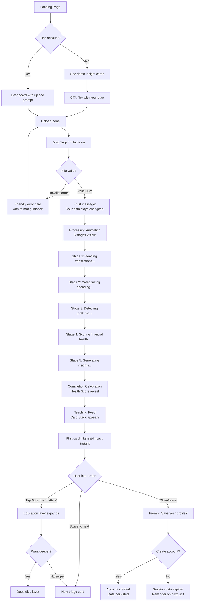
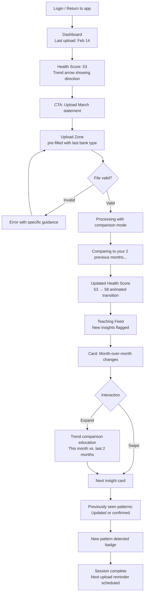
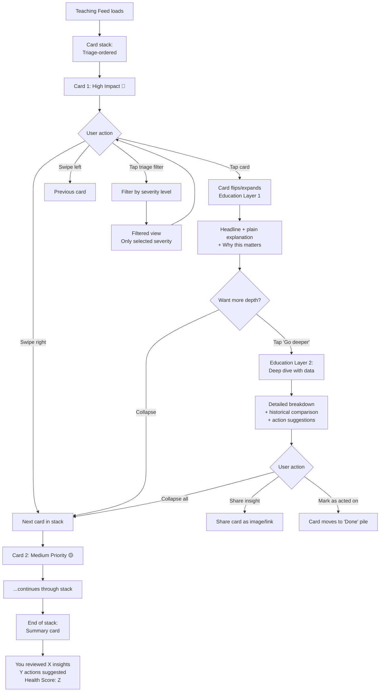
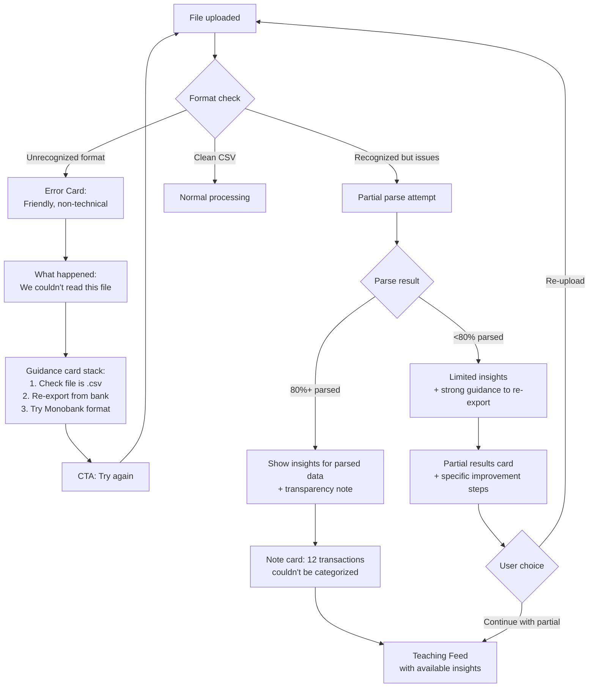

# UX Design Specification kōpiika

**Author:** Oleh
**Date:** 2026-03-16

---

<!-- UX design content will be appended sequentially through collaborative workflow steps -->

## Executive Summary

### Project Vision

kōpiika is an AI-powered personal finance platform where education is the product, not a feature. Users upload bank statements (CSV/PDF) through a trust-first model requiring no bank credentials, and a multi-agent AI pipeline processes, categorizes, detects patterns, triages by severity, and wraps every insight in personalized educational content. The primary interface is a Teaching Feed — a card-based insight feed sorted by financial impact, with progressive disclosure education layers. The product targets Ukraine's 9.88M+ Monobank users first, with bilingual Ukrainian/English support and a freemium model.

### Target Users

**Anya "The Learner"** (20-30, freelancer, low financial literacy) — Emotionally stressed about finances, avoids looking at her data, has irregular income. Needs plain language, emotional safety, zero jargon. UX priority: approachability, encouragement, guided learning. Success = understanding her spending patterns and setting her first savings goal.

**Viktor "The Optimizer"** (25-35, developer, moderate-high literacy) — Curious and data-driven, wants deeper analytics than Monobank's built-in tools. Comfortable with complexity but values efficiency. UX priority: information density, actionable specifics, exploration depth. Success = actionable spending optimizations and measurable savings improvement.

**Dmytro "The Discoverer"** (30-45, professional, high literacy, overconfident) — Time-pressured, expects conciseness and respect for his knowledge. Won't tolerate being lectured. UX priority: speed, surprise factor, minimal friction. Success = blind spot discovery in under 15 minutes per monthly session.

### Key Design Challenges

1. **Three literacy levels, one feed** — The Teaching Feed must serve Anya (needs hand-holding), Viktor (wants depth), and Dmytro (demands brevity) without feeling dumbed-down or overwhelming. Adaptive content depth and progressive disclosure are critical.

2. **File upload as a value moment** — CSV upload is manual and high-friction. The first-upload experience must deliver an immediate, tangible "aha moment" to justify the effort and establish the habit of repeat uploads.

3. **Triage without triggering avoidance** — Red/yellow/green severity indicators risk activating Anya's financial anxiety and avoidance spiral. The triage system must feel motivating ("here's your highest-impact opportunity") rather than alarming ("here's what's wrong").

4. **Progressive disclosure that flows naturally** — Education layers (headline → "why this matters" → deep-dive) must feel like a natural reading experience, not a buried FAQ. The insight must remain actionable at every disclosure level.

5. **Authentic bilingual experience** — Ukrainian and English interfaces must both feel native. Financial terminology, cultural framing (e.g., "making your money work harder" vs. "spending less"), and number formatting (comma decimals, hryvnia symbol placement) require careful localization, not just translation.

### Design Opportunities

1. **Cumulative intelligence as visible UX** — Each upload makes the system visibly smarter: richer insights, more accurate predictions, evolving Financial Health Score. This creates a compelling progress narrative, natural retention through increasing switching costs, and a tangible reason to upload regularly.

2. **Triage-first as signature pattern** — No personal finance competitor uses ER-style severity-ranked prioritization. This can become a recognizable, differentiated UX pattern that makes the product instantly actionable for users who would be overwhelmed by traditional dashboards.

3. **Emotional design for financial data** — The "teaching" metaphor unlocks warmth, encouragement, and approachability that clinical dashboards lack. Color, tone, micro-copy, and framing can transform financial data from anxiety-inducing to empowering — particularly for Anya's segment.

## Core User Experience

### Defining Experience

The core interaction model is a **card stack** — users deal with one insight card at a time, focused and undistracted, with the ability to navigate back through previously viewed cards. This is not a scrolling feed; each card commands full attention, receives proper consideration, and can be marked as read or acted-upon. The card stack metaphor naturally supports triage ordering (most important card first) and progressive disclosure (tap to expand education layers within each card).

The core loop is: **Upload → Watch cards appear progressively → Deal with cards one by one → Learn and act → Upload again next cycle**

Upload is triggered via a **persistent "+" button** accessible from any screen, reinforcing that uploading is a casual, repeatable action — not a ceremonial flow. The upload interaction targets 2 taps maximum: tap "+", select file, done.

After upload, cards **appear progressively** as each AI agent in the pipeline completes its work. The first cards (basic categorization insights) appear within seconds; deeper pattern detection and education cards follow. This transforms processing wait time into an engaging, real-time experience — users watch the AI "think" as cards materialize one by one with subtle animations.

### Platform Strategy

**Web app first**, responsive design. While desktop offers easier CSV file management, Ukraine's Monobank user base is overwhelmingly mobile-native. The design should be **mobile-informed** — optimized for touch, thumb-reachable interactions, and portrait orientation — while fully functional on desktop with mouse/keyboard equivalents.

Key platform decisions:
- **Mobile-informed responsive web** — card stack works beautifully on mobile (swipe gestures) and desktop (arrow keys/click navigation)
- **No offline requirement for V1** — financial insights require server-side AI processing
- **PWA consideration** — progressive web app capabilities (home screen install, push notifications) can bridge the gap before a native app in V2
- **File upload on mobile** — leverage the native file picker; Monobank's CSV export can be accessed from phone storage or email attachments

### Effortless Interactions

**Upload (2 taps):** Tap persistent "+" button → select file from device → done. No manual configuration, no bank selection (auto-detect format), no date range entry (parse from file). First-time upload may include a brief onboarding tooltip; subsequent uploads are frictionless.

**Card navigation:** Gesture-based on mobile (swipe left/right to navigate cards, swipe up to dismiss/mark read), click/arrow-key navigation on desktop. Navigation feels physical and responsive.

**Education expansion:** Progressive disclosure within each card operates as a natural pull-down/accordion. Tap the card to reveal "why this matters"; tap again or scroll within the card to reach the deep-dive education layer. No page navigation — everything happens in-context on the card itself.

**Language switching:** Instant toggle between Ukrainian and English, persistent across sessions. Not buried in settings — accessible from the main interface. All content (AI-generated insights, education, UI labels) switches together.

**Financial Health Score:** Always visible as a subtle, persistent element (header bar or dedicated summary card at the top of the stack). Score updates are animated to draw attention to progress.

### Critical Success Moments

1. **First card after first upload** — The moment the first insight card fades in with a real finding from the user's own data. This is where trust is established and the product proves its value. Must happen within seconds, not minutes.

2. **First surprise discovery** — The card that shows something the user genuinely didn't know: a forgotten subscription, an unexpectedly large spending category, a pattern they never noticed. This is the "aha moment" that drives word-of-mouth ("you won't believe what this app showed me").

3. **First education expansion** — User taps "why this matters" and receives a genuinely personalized, useful explanation — not generic financial advice, but insight connected to their specific data. This is where the product proves education is the product, not a bolted-on feature.

4. **Second upload — cumulative intelligence reveals itself** — The system references last month's data, shows trends, and demonstrates that it remembers and learns. "Based on your 2 months of data, your food delivery spending increased 23%." This is where retention locks in.

5. **Financial Health Score movement** — The first time the score changes (ideally improves) after the user acts on an insight. Visible, tangible proof that engagement creates results.

### Experience Principles

1. **One card, full attention** — Every interaction focuses on a single insight at a time. No cognitive overload, no dashboard paralysis. The card stack forces prioritization and ensures every insight gets its moment.

2. **Show, don't tell** — The AI's value is demonstrated through progressive card appearance, cumulative intelligence, and surprise discoveries — not through marketing copy or onboarding tutorials. The product teaches by doing.

3. **Motivate, never shame** — Triage severity indicates opportunity, not failure. "Here's your highest-impact insight" not "Here's what you're doing wrong." Financial data is presented as a tool for growth, never as a judgment.

4. **Effortless by default, deep on demand** — Every screen has a simple, obvious default action. Complexity is available but never forced. Anya sees a clear card with a headline; Viktor and Dmytro can drill into the data if they choose.

5. **Visibly smarter over time** — The system's growing intelligence is surfaced as a UX feature: richer insights, higher confidence, trend lines that lengthen, a Health Score that evolves. Users see the value of every upload compounding.

## Desired Emotional Response

### Primary Emotional Goals

**Clarity** — The product's primary emotional promise. Every interaction should make users feel like they understand their financial life more clearly than before. Clarity is the antidote to Anya's confusion, the upgrade to Viktor's existing knowledge, and the mirror for Dmytro's blind spots. If a user leaves a session feeling clearer about their money than when they arrived, the product has succeeded.

**Growth** — The secondary emotional thread running through every session. Users should feel themselves getting better at managing money — not through lectures, but through accumulated understanding. The Financial Health Score, cumulative intelligence, and evolving insights all reinforce that the user is on an upward trajectory.

**Clarity + Excitement** — The sharing trigger. When clarity and excitement combine — "I finally see something I never noticed, and it's actually thrilling, not scary" — users tell friends. This is the emotional formula behind the product's primary growth channel (word-of-mouth).

### Emotional Journey Mapping

| Stage | Desired Emotion | Design Implication |
|---|---|---|
| **Discovery / Landing** | Curiosity + Safety | Clean, warm visuals. No financial jargon on the landing page. "See what your bank statements can teach you" framing. |
| **First Upload** | Anticipation + Ease | The "+" button and file picker should feel effortless. Micro-animation on upload confirms action. No anxiety about "did it work?" |
| **Cards Appearing** | Excitement + Wonder | Progressive card appearance creates a "gift unwrapping" feeling. Each card fading in is a small surprise. The AI is working *for* you. |
| **Reading a Card** | Clarity + "Aha"  | The headline delivers instant understanding. No re-reading needed. The insight is obvious and the relevance to the user's life is immediate. |
| **Expanding Education** | Growth + Empowerment | "Why this matters" layer feels like a conversation with a smart friend, not a textbook. User feels smarter after reading, not lectured at. |
| **Completing the Stack** | Accomplishment + Motivation | Finishing all cards should feel like completing a meaningful review — not exhausting, not trivial. A sense of "I've got this handled." |
| **Returning Next Month** | Anticipation + Trust | The product remembered everything. New insights build on last month. The system is visibly smarter. "This keeps getting better." |
| **Something Goes Wrong** | Amusement + Reassurance | Humorous, lighthearted error states. "Our AI tripped over your spreadsheet — give it another try?" Never clinical, never alarming. |
| **Financial Health Score Improves** | Pride + Momentum | Score movement should feel earned and celebratory. Small but visible — a nudge that says "you're doing great, keep going." |

### Micro-Emotions

**Critical to cultivate:**
- **Confidence over confusion** — Every screen, every card, every label should feel immediately understandable. If a user hesitates or squints, the design has failed.
- **Trust over skepticism** — The AI's reasoning should feel transparent, not magical. "Based on your last 3 months..." builds trust. Black-box outputs erode it.
- **Delight over mere satisfaction** — The progressive card appearance, surprise discoveries, and humorous micro-copy create moments of genuine delight that elevate the experience above "useful tool" into "product I love."
- **Accomplishment over frustration** — Completing the card stack, seeing the Health Score move, acting on an insight — these are small wins that compound into a feeling of financial mastery.

**Critical to prevent:**
- **Confusion** — The absolute emotional third rail. No jargon, no ambiguous labels, no "what do I do now?" moments. If the user can't understand something in 3 seconds, simplify it.
- **Complexity** — The product must never feel like a finance tool built for finance people. The card stack, progressive disclosure, and triage ordering all exist to eliminate complexity. If it feels complex, strip layers until it doesn't.
- **Shame or judgment** — Financial data can trigger guilt, regret, and self-criticism. The product's tone must always frame findings as opportunities, never as failures. "You spent 12,000₴ on food delivery" is neutral data; "Here's an easy way to save 3,000₴/month" is opportunity framing.
- **Overwhelm** — Too many cards, too much data, too many options. The card stack naturally prevents this (one at a time), but the system must also limit the number of insights per upload to a digestible set.

### Design Implications

**Clarity → Clean visual hierarchy:** Single-focus card layout with generous whitespace. One headline, one key number, one call-to-action per card. Typography hierarchy that makes scanning effortless.

**Growth → Progress visualization:** Financial Health Score with animated transitions. "Upload streak" or data depth indicators. Month-over-month comparison cards that show trajectory. Language like "Based on 3 months of data..." that reminds users of cumulative intelligence.

**Excitement → Surprise mechanics:** Progressive card appearance with anticipation-building animation. Occasional "discovery" cards flagged differently ("Something new this month"). Insight headlines written to provoke curiosity before expanding.

**Humor → Warm error states and micro-copy:** Lighthearted loading messages ("Crunching your numbers..."), playful error recovery ("Our AI got confused by that file — mind trying again?"), friendly empty states. The tone is a smart, warm friend — never a bank, never a teacher.

**Anti-confusion → Ruthless simplicity:** Every label tested for instant comprehension. No financial jargon without inline explanation. Progressive disclosure ensures complexity is always opt-in, never forced. When in doubt, remove rather than add.

### Emotional Design Principles

1. **Clarity is king** — When any design decision creates tension between "more informative" and "more clear," choose clarity. Users can always expand for more; they can't un-confuse themselves.

2. **Earn delight through usefulness** — Delight comes from genuinely surprising, useful insights — not from animations, illustrations, or gamification tricks. The data itself is the source of emotional impact.

3. **Humor disarms financial anxiety** — A lighthearted tone in error states, loading screens, and edge cases signals that money doesn't have to be stressful. This is particularly critical for Anya's segment and sets the product apart from sterile fintech interfaces.

4. **Growth must be visible and felt** — Abstract claims ("you're improving!") mean nothing. Concrete evidence matters: a Health Score that moved 3 points, a spending category that dropped 15%, a trend line that's going the right way. Show the receipts.

5. **Never punish, always redirect** — If a user's finances reveal problems, the product's job is to show a path forward, not to spotlight the problem. Every red-triage card must include an actionable next step. No card should leave the user feeling stuck.

## UX Pattern Analysis & Inspiration

### Inspiring Products Analysis

**Monobank — Ukrainian-native fintech excellence**
- **What it solves:** Daily banking with zero friction for 9.88M+ Ukrainian users
- **UX strengths:** The jar system makes saving tangible and visual. Cashback animations create micro-delight on every purchase. Category breakdowns with cat icons feel playful, not clinical. The interface is Ukrainian-first — hryvnia formatting, local merchant recognition, culturally natural copy. Push notifications are timely and useful, not spammy.
- **What keeps users coming back:** Instant transaction notifications, cashback dopamine, jar progress. It's the one app users open multiple times daily.
- **Key lesson for kopiika-ai:** Monobank set the UX bar for Ukrainian fintech. Our product must feel like a natural extension of the Monobank experience — familiar visual language, same respect for Ukrainian conventions — while delivering value Monobank can't (education, pattern detection, triage insights).

**Duolingo — card-based learning with personality**
- **What it solves:** Language learning through bite-sized, gamified daily sessions
- **UX strengths:** One lesson at a time (card-based focus). Progress is visible and addictive (streaks, XP, league rankings). Humor and personality permeate every interaction — error states are charming, not frustrating. Progressive difficulty adapts to the learner. The owl mascot creates emotional connection. Micro-sessions (5-15 minutes) respect user time.
- **What keeps users coming back:** Streak mechanics, loss aversion ("don't break your streak"), daily reminders, visible progress, competitive leagues.
- **Key lesson for kopiika-ai:** Education through small, focused doses works. The card stack maps directly to Duolingo's one-lesson-at-a-time model. Humor and personality make learning feel like play. Streaks and progress visualization drive habitual return — our upload cadence and Financial Health Score can serve the same function.

**Tinder/Hinge — card stack interaction model**
- **What it solves:** Decision-making on a stream of options, one at a time
- **UX strengths:** The swipe mechanic is intuitive, physical-feeling, and addictive. One card at a time eliminates decision paralysis. Actions are binary and immediate (like/pass). The "stack" metaphor creates anticipation — "what's next?" Progressive disclosure on profiles (photo first, details on tap).
- **What keeps users coming back:** Novelty of each card, anticipation mechanics, the dopamine of a match.
- **Key lesson for kopiika-ai:** The card stack interaction model is proven at massive scale. Swipe gestures feel natural on mobile. One-at-a-time focus prevents overwhelm. We adapt this for insight cards: swipe to navigate, tap to expand education, the anticipation of "what insight is next?" drives engagement. Unlike Tinder, our cards have depth (progressive disclosure layers) — more like Hinge's richer profiles.

**Apple Fitness — health score visualization and progress tracking**
- **What it solves:** Activity tracking with motivating progress visualization
- **UX strengths:** The Activity Rings are one of the most iconic progress visualizations ever designed — simple, colorful, immediately understandable, deeply satisfying to close. Trends show long-term trajectory with clear up/down arrows. The summary screen balances simplicity (rings) with depth (scroll for details). Awards and milestones celebrate progress without feeling childish. Data accumulates visibly — more history = richer insights.
- **What keeps users coming back:** Ring closure motivation, streak tracking, trend visualization that rewards consistency, monthly challenges.
- **Key lesson for kopiika-ai:** This is the strongest model for our Financial Health Score visualization. Apple Fitness proves that a single, visible score (the rings) can drive behavior change at scale. The combination of daily motivation (close the ring / check the feed) with long-term trajectory (trends / cumulative intelligence) is exactly what kopiika-ai needs. The "earned celebration" on milestones — not gamification gimmicks, but genuine recognition of progress — aligns perfectly with our "growth must be visible and felt" principle.

**YNAB (You Need A Budget) — financial education through methodology**
- **What it solves:** Budgeting through a specific methodology ("give every dollar a job")
- **UX strengths:** Opinionated methodology embedded in the UX — the product teaches a system, not just a tool. Excellent onboarding that educates while setting up. "Age of Money" metric makes an abstract concept (financial health) tangible and trackable. Color-coded budget categories with clear over/under status. Strong community and educational content ecosystem.
- **What keeps users coming back:** The methodology becomes a habit. "Age of Money" improvement is addictive. The guilt of unassigned money drives categorization.
- **Key lesson for kopiika-ai:** YNAB proves that embedding financial education directly into the product UX works — users learn the methodology by using the tool, not by reading docs. Their "Age of Money" metric is a direct parallel to our Financial Health Score: a single number that captures financial health and motivates improvement. The key difference: YNAB requires significant upfront effort and financial literacy to start. Gen-ai must deliver value with zero effort (just upload) and zero prerequisite knowledge.

### Transferable UX Patterns

**Navigation Patterns:**
- **Card stack with swipe navigation** (from Tinder/Hinge) — one insight at a time, swipe to move through the triage-ordered stack. Adapts naturally to mobile touch and desktop click/keyboard.
- **Tab-based primary navigation** (from Monobank) — simple bottom tab bar: Feed (card stack), Score (Financial Health), History (past uploads/insights), Profile/Settings. Maximum 4-5 tabs, thumb-reachable on mobile.

**Interaction Patterns:**
- **Progressive disclosure accordion** (from Hinge profiles) — tap a card to expand "why this matters," tap/scroll further for deep-dive education. Each layer reveals more without leaving the card context.
- **Progressive card appearance** (unique to kopiika-ai, inspired by chat message animation) — cards fade/slide in as AI agents complete processing, creating an anticipation mechanic similar to watching a chat response stream in.
- **Swipe-to-dismiss/mark-read** (from Tinder) — swipe up on a card to mark as read/acknowledged. Creates a satisfying "clearing the inbox" feeling.

**Visual Patterns:**
- **Activity Rings / Score Visualization** (from Apple Fitness) — Financial Health Score rendered as a circular progress indicator. Simple, colorful, immediately understandable. Score changes animated to draw attention.
- **Triage color coding** (medical/aviation inspired) — not traditional red/yellow/green traffic lights, but warm-toned severity indicators: perhaps coral (high priority), amber (medium), sage/teal (low/positive). Avoids harsh red that triggers anxiety.
- **Monobank-familiar aesthetics** — dark mode option, clean sans-serif typography, Ukrainian-native number and currency formatting. Users should feel visual kinship with the app they already trust.

**Engagement Patterns:**
- **Upload streak** (from Duolingo) — lightweight streak tracking for monthly uploads. Not punitive, but visible: "3 months of insights and counting." Reinforces the habit loop.
- **Milestone celebrations** (from Apple Fitness) — when Financial Health Score crosses a threshold or a user acts on a key insight, a brief, earned celebration moment. Not confetti overload — Apple Fitness-level restraint.
- **Cumulative intelligence callouts** (unique to kopiika-ai) — explicit language like "Based on your 4 months of data..." that makes the growing intelligence feel tangible, similar to how Apple Fitness trends become richer with more data.

### Anti-Patterns to Avoid

1. **Dashboard-first design** (most PFM tools) — Traditional finance apps lead with charts, graphs, and category breakdowns that assume financial literacy. This overwhelms Anya and bores Dmytro. The card stack avoids this by delivering curated, prioritized insights.

2. **YNAB-level upfront effort** — YNAB requires users to categorize every transaction manually and learn a methodology before getting value. Gen-ai must deliver value on first upload with zero configuration. AI does the work; users consume the insights.

3. **Gamification overload** (some Duolingo criticism) — Streaks, points, badges, leagues, and leaderboards can feel manipulative and distract from core value. Gen-ai should use engagement mechanics sparingly: upload streaks and score milestones only, earned through genuine financial progress.

4. **Jargon-heavy financial interfaces** — Terms like "net cash flow," "asset allocation," "debt-to-income ratio" without explanation. Every financial term in kopiika-ai must either be replaced with plain language or accompanied by an inline explanation.

5. **Notification spam** — Aggressive push/email notifications that train users to ignore them. Gen-ai notifications should be rare, valuable, and tied to real events: "New insights ready from your latest upload" or "Your Financial Health Score improved."

6. **Static, non-personalized education** — Generic financial tips disconnected from the user's data. Every educational element in kopiika-ai must reference the user's actual transactions and patterns. "Save more money" is useless; "Your food delivery spending last month could fund 2 months of your savings goal" is actionable.

### Design Inspiration Strategy

**What to Adopt:**
- **Apple Fitness ring-style score visualization** — for Financial Health Score. Simple, iconic, motivating. The single strongest visual element to borrow.
- **Card stack navigation with swipe gestures** — from Tinder/Hinge. Proven at scale, perfect for mobile-first triage feed.
- **Duolingo's tone and humor** — lighthearted micro-copy, friendly error states, personality in the product voice. Critical for disarming financial anxiety.
- **Monobank's Ukrainian design sensibility** — dark mode, clean typography, currency/number formatting. Users should feel at home.

**What to Adapt:**
- **Duolingo's streak mechanic** — adapt for monthly (not daily) upload cadence. Lighter touch, no punitive loss-aversion messaging. "3 months of insights" not "Don't break your streak!"
- **YNAB's methodology-embedded-in-UX approach** — instead of requiring users to learn a system, kopiika-ai teaches financial concepts through the insights themselves. Education is embedded in the card content, not in onboarding or separate courses.
- **Apple Fitness trends** — adapt long-term trend visualization for financial data. Spending trends, category evolution, Health Score trajectory over months. Becomes richer with more uploads.

**What to Avoid:**
- **Monobank's category charts as primary UX** — good as supplementary (V1 fast-follow dashboard), but not as the primary interaction. Charts assume literacy and don't teach.
- **YNAB's manual categorization requirement** — AI handles categorization; users correct only if they want to. Zero-effort value delivery.
- **Duolingo's aggressive notification strategy** — respect user attention. Quality over quantity.
- **Tinder's addictive emptiness** — the card stack should feel productive and educational, not endlessly scrollable. A finite stack with a satisfying "you're all caught up" end state.

## Design System Foundation

### Design System Choice

**shadcn/ui + Tailwind CSS** — a themeable, component-level design system built on Radix UI primitives, styled with Tailwind CSS utility classes, and designed specifically for Next.js / React applications.

shadcn/ui is not a traditional component library installed as a dependency — components are copied directly into the project source, giving full ownership and customization control. Radix UI primitives underneath provide robust accessibility (ARIA patterns, keyboard navigation, screen reader support) without imposing visual constraints.

### Rationale for Selection

1. **Next.js native** — shadcn/ui is built for the Next.js / React ecosystem. No compatibility layer, no adapter patterns. Components work with App Router, Server Components, and the full Next.js feature set out of the box.

2. **Full customization ownership** — Components live in the project codebase, not in node_modules. The card stack, Financial Health Score ring, triage severity indicators, and progressive card appearance are all custom UX patterns that require deep control. shadcn/ui provides the foundation (buttons, forms, navigation, modals, accordions) while staying completely out of the way for signature interactions.

3. **Tailwind CSS for rapid styling** — Utility-first CSS enables fast iteration on visual design without context-switching to separate stylesheets. Dark mode support is built into Tailwind's class strategy (`dark:` prefix). Responsive design utilities (`sm:`, `md:`, `lg:`) make mobile-informed responsive layouts straightforward.

4. **Solo developer velocity** — Smallest gap between design intent and implementation. No fighting library opinions, no overriding opinionated styles, no bundle bloat from unused components. Copy what you need, customize it, ship.

5. **Accessibility by default** — Radix UI primitives handle focus management, keyboard navigation, ARIA attributes, and screen reader announcements. Critical for a financial product that must be accessible to all Ukrainian users.

6. **Dark mode built-in** — Tailwind's dark mode strategy plus shadcn/ui's theme system supports the Monobank-familiar dark aesthetic with minimal configuration. Light mode equally supported for user preference.

7. **Community and longevity** — shadcn/ui is one of the most actively maintained and widely adopted UI systems in the React ecosystem as of 2026. Extensive documentation, active community, and consistent updates.

### Implementation Approach

**Base layer (shadcn/ui components):**
- Navigation: Tabs, NavigationMenu (bottom tab bar)
- Data entry: Button, Input, Select, Form (upload, settings, auth)
- Feedback: Toast, Alert, Dialog (notifications, confirmations, errors)
- Layout: Card, Separator, ScrollArea (card container, content sections)
- Disclosure: Accordion, Collapsible (progressive education layers)
- Overlay: Sheet, Popover, Tooltip (mobile panels, contextual help, onboarding hints)

**Custom layer (project-specific components):**
- **InsightCard** — The core card stack card with triage severity indicator, headline, key metric, and progressive disclosure layers. Built on shadcn Card primitive with custom animation and gesture handling.
- **CardStack** — The swipeable/navigable stack container. Custom component with touch gesture support (swipe left/right/up) and keyboard navigation (arrow keys).
- **HealthScoreRing** — Apple Fitness-inspired circular progress visualization for Financial Health Score. Custom SVG/Canvas component with animated transitions.
- **TriageBadge** — Warm-toned severity indicator (coral/amber/sage). Custom styled Badge variant.
- **ProgressiveCardLoader** — Animated card appearance component for the post-upload progressive loading experience. Custom animation with Framer Motion or CSS transitions.
- **UploadButton** — Persistent "+" floating action button with file picker integration.

**Animation library:** Framer Motion for card stack gestures (swipe physics, spring animations), progressive card appearance, Health Score ring transitions, and micro-interactions. Framer Motion integrates naturally with React and provides the physical-feeling animations the card stack requires.

### Customization Strategy

**Design tokens (Tailwind theme extension):**
- **Colors:** Warm-toned palette diverging from clinical fintech blues. Triage severity: coral (`--triage-high`), amber (`--triage-medium`), sage/teal (`--triage-low`/`--triage-positive`). Brand accent color to be defined. Dark mode as primary, light mode as alternative.
- **Typography:** Clean sans-serif (Inter or similar) with Ukrainian Cyrillic support. Clear hierarchy: card headline (large, bold), key metric (large, colored), body text (readable), education text (slightly smaller, warm).
- **Spacing:** Generous whitespace aligned with the "one card, full attention" principle. Card padding, inter-element spacing, and touch targets sized for mobile-first (minimum 44px tap targets).
- **Border radius:** Rounded corners on cards and interactive elements for warmth. Slightly more rounded than typical fintech (approachable, not clinical).
- **Shadows/elevation:** Subtle card elevation to reinforce the "stack" metaphor. Active card slightly elevated above the stack.

**Component theming:**
- Override shadcn/ui default theme variables in `globals.css` to match brand palette
- Extend Tailwind config with custom colors, spacing, and typography scales
- Create component variants (e.g., InsightCard variants for different triage levels, card states)

**Responsive strategy:**
- Mobile breakpoint as default (mobile-first Tailwind)
- Tablet: card stack with slightly wider cards, side navigation option
- Desktop: centered card stack with keyboard navigation, optional sidebar for Health Score and quick stats

## Defining Experience

### The Defining Interaction

**"Upload → Watch → Discover"**

The defining experience of kopiika-ai is the moment after a user drops in their bank statement and watches AI-generated insight cards appear one by one, each revealing something about their financial life they didn't know. This is what users will describe to friends: *"You just drop in your Monobank statement and it starts showing you things about your spending you never noticed."*

The defining interaction is not the upload (that's just 2 taps), not reading a single card (that's consumption), and not the education layer (that's depth). It's the **reveal** — the transition from "I have data" to "I have understanding." The progressive card appearance creates a theatrical quality: the AI is performing an analysis in real-time, and each card that materializes is a small discovery.

**The magic triangle that makes this feel different from "another analytics tool":**

1. **Progressive card appearance** — Watching the AI think. Cards fade in as agents complete, creating anticipation and a sense that the system is actively working for you. This is the emotional hook.
2. **Triage ordering** — Knowing what matters most. The first card is always the highest-impact insight. Users don't have to figure out what's important — the system tells them.
3. **Education layer** — Learning, not just seeing. Every insight teaches something. Users leave each session financially smarter, not just more informed.

Remove any one of these three elements and the product becomes generic: without progressive appearance, it's a static dashboard. Without triage ordering, it's an unsorted list. Without education, it's Monobank analytics with extra steps.

### User Mental Model

**How users currently solve this problem (they mostly don't):**

| Persona | Current Approach | Mental Model | Gap |
|---|---|---|---|
| **Anya** | Avoidance. Checks Monobank balance to see "what's left." Never analyzes. | Money = anxiety. Looking closer makes it worse. | Needs the product to make looking feel safe and rewarding, not scary. |
| **Viktor** | Eyeballs. Occasionally exports statements, scans numbers manually. | Money = optimization puzzle. Has the interest but lacks the tools. | Needs the product to surface patterns he can't see by manual scanning. |
| **Dmytro** | Memory and gut feel. Believes he knows where his money goes. | Money = under control. Doesn't think he needs help. | Needs the product to crack his confidence with data he can't argue with. |

**Mental model shift the product creates:**

- **From:** "My bank statement is a list of transactions" → **To:** "My bank statement is a source of insights about my financial life"
- **From:** "Understanding my finances requires effort and knowledge" → **To:** "Understanding my finances is as easy as swiping through cards"
- **From:** "Financial tools are for financially literate people" → **To:** "This tool makes me financially literate by using it"

**Key mental model consideration:** Users arrive with a "bank statement = boring data" frame. The progressive card appearance must immediately break this frame by showing that the same data they've been ignoring contains surprising, personally relevant discoveries. The first card after first upload is the frame-breaking moment.

### Success Criteria

**The defining experience succeeds when:**

1. **Speed to first insight** — The first card appears within 5-10 seconds of upload. Not minutes, not "we'll email you." The user must see value before they have time to context-switch.

2. **Genuine surprise** — At least one card in every upload session shows the user something they genuinely didn't know. A forgotten subscription, an unexpectedly large category, a trend they never noticed. If every insight is obvious, the product has failed.

3. **Immediate comprehension** — Every card headline is understood in under 3 seconds without re-reading. No jargon, no ambiguity. The insight is clear at the headline level; education is available but not required to grasp the core finding.

4. **Desire to see the next card** — After reading one card, the user wants to swipe to the next. The triage ordering and progressive disclosure create a "what's next?" pull that keeps users moving through the stack.

5. **Feeling smarter after** — After completing the card stack, the user feels they understand their financial life better than before. This is the "clarity + growth" emotional goal manifested as a tangible outcome.

6. **Wanting to share** — At least some users, after their first session, feel compelled to tell someone: "You need to try this." This is the word-of-mouth trigger that validates the defining experience.

**Anti-success indicators (the experience has failed when):**

- User uploads and leaves before first card appears (too slow)
- User reads a card and says "I already knew that" (no surprise)
- User re-reads a card headline and still doesn't understand (too complex)
- User stops at 1-2 cards and doesn't continue (no pull)
- User finishes and shrugs (no emotional impact)

### Novel UX Patterns

**The defining experience combines familiar patterns in an innovative way:**

| Element | Pattern Type | Source | Innovation for kopiika-ai |
|---|---|---|---|
| **Card stack navigation** | Established | Tinder, Hinge, dating apps | Applied to financial insights instead of people. Cards have progressive disclosure depth (headline → why it matters → deep-dive education) that dating cards don't. |
| **Progressive content appearance** | Semi-novel | Chat streaming (ChatGPT), social feed loading | Applied to AI-generated insight cards. Each card represents a complete analysis unit from a different AI agent, not a streaming text response. The "watching the AI think" quality is unique. |
| **Triage severity ordering** | Novel in context | Emergency medicine, IT incident management | Never applied to personal finance UX before. Severity-ranked financial insights is a signature pattern with no direct competitor precedent. |
| **Progressive disclosure education** | Established | Accordion/expandable UI, FAQ patterns | Applied within each card as a three-layer system (headline → context → education). The innovation is that education is embedded in every insight, not separated into a "learn" section. |
| **Cumulative intelligence visualization** | Semi-novel | Apple Fitness trends, Health app history | Applied to financial data with explicit "system getting smarter" narrative. Each upload visibly enriches the intelligence, shown through language ("Based on your 4 months...") and richer insights. |

**Teaching the novel patterns:**

- **Triage severity** needs no formal teaching — the color coding (coral/amber/sage) and card ordering make priority self-evident. A single onboarding tooltip ("Your highest-impact insight is always first") is sufficient.
- **Progressive card appearance** is self-explanatory — users watch it happen. The animation itself teaches the pattern.
- **Progressive disclosure** may need a subtle first-time prompt — a "tap to learn more" hint on the first card that disappears after the user discovers the pattern.

### Experience Mechanics

**1. Initiation — Upload**

| Step | User Action | System Response | Time |
|---|---|---|---|
| Trigger | Taps persistent "+" button (visible on every screen) | File picker opens (native OS dialog) | Instant |
| Selection | Selects CSV/PDF file from device | File picker closes, upload begins | Instant |
| Confirmation | None needed — upload starts automatically on file selection | Upload progress indicator appears briefly. "Analyzing your transactions..." message. | 1-3 seconds |
| Transition | None — user stays on feed screen | Feed area clears/prepares for new cards. Subtle loading animation begins. | Immediate |

**2. Interaction — The Reveal**

| Step | What Happens | Emotional Beat | Time |
|---|---|---|---|
| First card appears | Ingestion complete → first insight card fades in with subtle animation | Excitement — "it's working, it found something" | 5-10 seconds after upload |
| Card reading | User reads headline and key metric. Triage severity badge visible. | Clarity — "I understand this immediately" | 3-5 seconds per card |
| Education expansion (optional) | User taps card → "Why this matters" layer slides down. Tap again → deep-dive education. | Growth — "I'm learning something useful" | 10-30 seconds if expanded |
| More cards appear | Additional cards fade in while user reads existing ones. Stack count updates. | Anticipation — "there's more to discover" | Ongoing, 10-60 seconds between cards |
| Navigation | Swipe left/right (mobile) or click arrows/arrow keys (desktop) to move between cards | Control — "I can go at my own pace" | Continuous |

**3. Feedback — Knowing it's working**

| Signal | Implementation | Purpose |
|---|---|---|
| Card count indicator | "Card 2 of 7" or dot pagination at bottom | Tells user how far through the stack they are and how much is left |
| New card notification | Subtle pulse/badge on stack when a new card appears while reading another | Signals more discoveries available without interrupting current reading |
| Triage severity badge | Coral/amber/sage colored badge on each card | Instantly communicates importance without reading |
| "Based on X months of data..." | Text on cards that reference cumulative history | Reinforces that the system is using all their data, not just this upload |
| Processing indicator | Subtle animation while AI agents are still working | Tells user more cards may be coming — don't leave yet |

**4. Completion — The satisfying end**

| Step | What Happens | Emotional Beat |
|---|---|---|
| Last card reached | User navigates past final card | "I've seen everything" |
| Completion state | "You're all caught up" card with Financial Health Score summary, upload streak count, and "next upload" prompt | Accomplishment — "I've handled my finances for this period" |
| Score update | Financial Health Score animates to new value (if changed) | Pride — "I'm making progress" |
| Call to action | Soft prompt: "Upload next month's statement to see how things change" | Anticipation — "I want to see what's next" |
| Return to feed | Previous cards remain accessible in a "reviewed" state for reference | Trust — "I can always come back to this" |

## Visual Design Foundation

### Color System

**Philosophy:** Warm, energetic, and approachable — not clinical fintech blue/gray. Colors support the emotional goals of clarity (clean contrast), growth (upward-feeling accent tones), and humor (warmth that allows playfulness). The palette avoids triggering financial anxiety while maintaining seriousness about money.

**Mode Strategy:** Dark mode as default (Monobank-familiar, premium feel), with full light mode support as user preference. Both modes use the same semantic color tokens with inverted background/surface values.

**Dark Mode Palette (Default):**

| Token | Role | Value | Description |
|---|---|---|---|
| `--background` | Page background | `#0F1117` | Deep warm charcoal, not pure black. Slight warmth distinguishes from cold terminal-black. |
| `--surface` | Card/container background | `#1A1D27` | Elevated surface for insight cards. Warm undertone. |
| `--surface-elevated` | Active card / modal | `#242836` | Higher elevation for focused elements. |
| `--border` | Subtle borders | `#2E3345` | Low-contrast dividers that don't compete with content. |
| `--text-primary` | Headlines, key content | `#F0F0F3` | Near-white with slight warmth. Not pure #FFF. |
| `--text-secondary` | Supporting text, labels | `#9CA3B4` | Muted but readable. For education text, metadata. |
| `--text-tertiary` | Placeholders, hints | `#6B7280` | Low emphasis. Disabled states, timestamps. |

**Light Mode Palette:**

| Token | Role | Value | Description |
|---|---|---|---|
| `--background` | Page background | `#FAFAF9` | Warm off-white. Not pure white — reduces eye strain. |
| `--surface` | Card/container background | `#FFFFFF` | Clean white cards on warm background. |
| `--surface-elevated` | Active card / modal | `#FFFFFF` | White with subtle shadow for elevation. |
| `--border` | Subtle borders | `#E5E5E3` | Warm gray borders. |
| `--text-primary` | Headlines, key content | `#1A1D27` | Dark warm charcoal. Same as dark mode surface — creates visual consistency across modes. |
| `--text-secondary` | Supporting text | `#6B7280` | Medium gray for secondary content. |
| `--text-tertiary` | Placeholders, hints | `#9CA3B4` | Light gray for low emphasis. |

**Accent Colors:**

| Token | Role | Value (Dark) | Value (Light) | Usage |
|---|---|---|---|---|
| `--accent-primary` | Brand accent, CTAs | `#6C63FF` | `#5B54E6` | Primary buttons, active states, links. A warm violet that feels energetic and modern without being aggressive. |
| `--accent-primary-subtle` | Accent backgrounds | `#6C63FF15` | `#5B54E615` | Subtle highlight backgrounds, selected states. |
| `--accent-secondary` | Secondary actions | `#38BDF8` | `#0EA5E9` | Secondary buttons, informational highlights. Cool blue as complement to warm violet. |

**Triage Severity Colors:**

| Token | Severity | Value (Dark) | Value (Light) | Usage |
|---|---|---|---|---|
| `--triage-high` | High priority | `#F07068` | `#E05A52` | Coral — warm red that feels urgent but not alarming. Forgotten subscriptions, spending spikes. |
| `--triage-high-bg` | High priority bg | `#F0706815` | `#E05A5212` | Subtle card tint for high-priority cards. |
| `--triage-medium` | Medium priority | `#F0A858` | `#E09840` | Amber — attention-worthy but not urgent. Spending trends, optimization opportunities. |
| `--triage-medium-bg` | Medium priority bg | `#F0A85815` | `#E0984012` | Subtle card tint for medium-priority cards. |
| `--triage-low` | Low priority / positive | `#5BC4A8` | `#4AB397` | Sage/teal — positive, calm. Good habits, improvements, educational insights. |
| `--triage-low-bg` | Low priority bg | `#5BC4A815` | `#4AB39712` | Subtle card tint for positive cards. |

**Semantic Colors:**

| Token | Role | Value (Dark) | Value (Light) |
|---|---|---|---|
| `--success` | Positive outcomes, score improvement | `#5BC4A8` | `#4AB397` |
| `--warning` | Caution states | `#F0A858` | `#E09840` |
| `--error` | Error states, failures | `#F07068` | `#E05A52` |
| `--info` | Informational, neutral | `#38BDF8` | `#0EA5E9` |

**Financial Health Score Ring Colors:**

| Score Range | Color | Meaning |
|---|---|---|
| 0-30 | `--triage-high` (coral) | Needs attention — significant opportunities for improvement |
| 31-60 | `--triage-medium` (amber) | Making progress — room for optimization |
| 61-80 | `--accent-primary` (violet) | Strong — good financial habits with refinement opportunities |
| 81-100 | `--triage-low` (sage/teal) | Excellent — strong financial health |

The ring gradient transitions smoothly between these zones as the score changes, creating an Apple Fitness-like visual reward for improvement.

### Typography System

**Primary Typeface: DM Sans**

DM Sans is a geometric sans-serif with slightly rounded terminals that creates a warm, approachable feel while maintaining professional clarity. Key selection factors:
- **Excellent Cyrillic support** — Ukrainian characters (і, ї, є, ґ) render cleanly and feel native, not bolted-on
- **Warm personality** — slightly rounded letterforms feel friendly without being casual. Supports the "smart, warm friend" tone
- **Strong weight range** — Regular (400), Medium (500), SemiBold (600), Bold (700) provide clear hierarchy
- **Google Fonts availability** — free, self-hostable, excellent performance via `next/font`
- **Readability** — generous x-height and open counters make financial data (numbers, currency) highly legible at all sizes

**Type Scale (based on 16px base):**

| Token | Size | Weight | Line Height | Usage |
|---|---|---|---|---|
| `--text-display` | 32px / 2rem | Bold (700) | 1.2 | Financial Health Score number, hero metrics |
| `--text-h1` | 24px / 1.5rem | SemiBold (600) | 1.3 | Page titles, section headers |
| `--text-h2` | 20px / 1.25rem | SemiBold (600) | 1.35 | Card headlines — the insight title |
| `--text-h3` | 18px / 1.125rem | Medium (500) | 1.4 | Sub-sections, key metrics on cards |
| `--text-body` | 16px / 1rem | Regular (400) | 1.6 | Body text, "why this matters" education layer |
| `--text-body-sm` | 14px / 0.875rem | Regular (400) | 1.5 | Deep-dive education text, secondary info |
| `--text-caption` | 12px / 0.75rem | Medium (500) | 1.4 | Labels, timestamps, metadata, triage badges |
| `--text-overline` | 11px / 0.6875rem | SemiBold (600) | 1.4 | Category labels, card type indicators (uppercase tracking) |

**Numeric Typography:**

Financial data requires special typographic attention:
- **Tabular figures** (`font-variant-numeric: tabular-nums`) for all monetary amounts — digits align vertically in lists and comparisons
- **Ukrainian number formatting** — comma as decimal separator, space as thousands separator (e.g., `12 450,00 ₴`)
- **Currency symbol placement** — hryvnia sign (₴) after the number per Ukrainian convention
- **Key metrics in `--text-display` or `--text-h3`** — financial numbers should be large and immediately scannable on cards

### Spacing & Layout Foundation

**Base Spacing Unit: 4px**

All spacing derives from a 4px base unit, creating consistent rhythm:

| Token | Value | Usage |
|---|---|---|
| `--space-1` | 4px | Tight spacing — between icon and label, between badge elements |
| `--space-2` | 8px | Default gap — between related elements within a component |
| `--space-3` | 12px | Component internal padding — inside buttons, badges |
| `--space-4` | 16px | Standard padding — card internal padding, section gaps |
| `--space-5` | 20px | Medium separation — between card sections (headline, body, education) |
| `--space-6` | 24px | Section separation — between major content areas |
| `--space-8` | 32px | Large separation — between cards in stack view, page sections |
| `--space-10` | 40px | Page margins (mobile) |
| `--space-12` | 48px | Page margins (desktop), major section breaks |

**Layout Structure:**

**Mobile (default, < 768px):**
- Full-width card stack centered in viewport
- Card width: 100% minus 2 × `--space-5` (20px) horizontal padding = edge-to-edge with breathing room
- Bottom tab navigation: 4 tabs (Feed, Score, History, Settings), 56px height, thumb-reachable
- Persistent "+" upload button: floating action button, 56px, bottom-right above tab bar
- Card stack occupies remaining vertical space between header and tab bar

**Tablet (768px - 1024px):**
- Card stack centered, max-width 560px
- Optional side margin for Health Score quick-view
- Bottom tab navigation persists

**Desktop (> 1024px):**
- Two-column layout: main card stack (max-width 560px, centered) + right sidebar (280px) for Health Score ring, upload streak, quick stats
- Top navigation replaces bottom tabs
- Keyboard navigation: arrow keys for card stack, Enter to expand, Escape to collapse
- Persistent "+" button moves to header area

**Card Dimensions:**
- Min-height: 200px (collapsed card with headline + key metric + triage badge)
- Max-height: 80vh (expanded with full education deep-dive, scrollable)
- Border radius: 16px (warm, rounded — more than typical fintech, less than playful/childish)
- Elevation: subtle box-shadow (`0 2px 8px rgba(0,0,0,0.15)` dark mode, `0 2px 12px rgba(0,0,0,0.08)` light mode)

**Touch Targets:**
- Minimum 44px × 44px for all interactive elements (Apple HIG standard)
- Card swipe zone: full card surface area
- Education accordion tap zone: full width of the expandable section header

### Accessibility Considerations

**Color Contrast:**
- All text-on-background combinations meet **WCAG 2.1 AA** minimum (4.5:1 for body text, 3:1 for large text)
- Triage severity colors are **never the only indicator** — each severity level also has text labels ("High Priority," "Worth Checking," "Looking Good") and positional ordering
- Dark mode and light mode both independently meet contrast requirements
- Financial amounts use `--text-primary` (highest contrast) regardless of card triage color

**Typography Accessibility:**
- Base font size 16px prevents browser zoom issues on mobile
- Line heights of 1.5+ for body text (WCAG recommendation)
- No text smaller than 11px (`--text-overline`) and only for non-essential metadata
- User-scalable text (no `maximum-scale` viewport restriction)

**Motion and Animation:**
- All animations respect `prefers-reduced-motion` media query
- Progressive card appearance gracefully degrades to instant appearance with reduced motion
- Card stack navigation works without swipe gestures (button/arrow alternatives always available)
- Health Score ring animation can be disabled — score displays as static number

**Screen Reader Support:**
- Triage severity announced as text ("High priority insight"), not just color
- Card stack position announced ("Insight 2 of 7")
- Progressive disclosure state announced ("Expanded" / "Collapsed")
- Financial amounts formatted for screen reader clarity ("twelve thousand four hundred fifty hryvnias" not "12450")

**Keyboard Navigation:**
- Full card stack navigation via arrow keys
- Enter/Space to expand education layers
- Tab key navigates between interactive elements within a card
- Escape collapses expanded education and returns to card-level focus
- Skip-to-content link for screen reader users

## Design Direction Decision

### Design Directions Explored

Eight design directions were generated and visualized in the interactive HTML showcase (`ux-design-directions.html`):

1. **Card Stack (Mobile Primary)** — Single-card-at-a-time Teaching Feed with swipe navigation, triage-ordered insights, and progressive disclosure education layers. The flagship interaction model.
2. **Desktop Dashboard** — Two-column layout with Health Score ring sidebar and scrollable card feed. Optimized for wider screens with persistent navigation.
3. **Compact List View** — Dense, scannable list format for Viktor/Dmytro personas who prefer efficiency over visual richness. Expandable rows with inline education.
4. **Processing Animation** — Multi-stage file upload experience showing the AI pipeline at work (parsing → categorizing → detecting patterns → generating insights). Builds trust through transparency.
5. **Completion Celebration** — Post-processing transition screen with Health Score reveal animation and summary statistics. The "aha moment" that justifies the upload effort.
6. **Onboarding Flow** — Trust-first first-run experience with privacy messaging, sample data preview, and progressive trust-building before first upload.
7. **Error & Edge States** — Friendly, non-technical error handling including upload failures, unsupported formats, and empty states. Lighthearted tone that avoids triggering financial anxiety.
8. **Light Mode Comparison** — Warm light palette alternative (`#FAFAF9` base) shown side-by-side with dark mode. User-switchable, both modes designed intentionally.

### Chosen Direction

**Primary: Direction 1 (Card Stack)** as the core mobile-first experience, supported by the full set of complementary directions:

- **Card Stack** as the default Teaching Feed interaction — one insight at a time, triage-sorted, with progressive disclosure
- **Desktop Dashboard** layout for wider screens — Health Score sidebar + scrollable feed
- **Compact List** as a user-switchable alternative view for power users
- **Processing Animation** as the upload experience — transparency builds trust
- **Completion Celebration** as the post-processing reveal — delivers the "aha moment"
- **Dark mode default** with light mode as a user-switchable preference
- **Onboarding** and **Error States** as designed — trust-first, anxiety-aware

### Design Rationale

The Card Stack direction was chosen as the primary experience because:

1. **Aligns with education-first vision** — One insight at a time prevents cognitive overload and forces each teaching moment to be absorbed before moving on
2. **Serves all three personas** — Anya gets manageable, non-overwhelming bites; Viktor can expand into depth; Dmytro can swipe through quickly to find surprises
3. **Triage ordering delivers value immediately** — Highest-impact insights surface first, so even users who only look at 2-3 cards get maximum value
4. **Progressive disclosure solves the literacy spectrum** — The card headline works for everyone; the "Why this matters →" layer adapts depth to the user's curiosity level
5. **Mobile-first matches the market** — Monobank is a mobile-first bank; users expect a mobile-native experience
6. **Processing animation builds trust** — Showing the AI pipeline at work (not a black box) is essential for the trust-first model

### Implementation Approach

**Phase 1 — Core Card Stack:**
- Implement the mobile Teaching Feed with swipe card navigation
- Build triage-ordered card rendering with three severity levels (High Impact / Worth Checking / Good to Know)
- Implement progressive disclosure: card → expanded education → deep dive
- Health Score ring with animated reveal

**Phase 2 — Upload Experience:**
- Multi-stage processing animation with real pipeline status
- Completion celebration with score reveal
- Error states with friendly, non-technical messaging

**Phase 3 — Multi-View Support:**
- Desktop two-column dashboard layout
- Compact list view toggle for power users
- Light/dark mode toggle with system preference detection

**Phase 4 — Onboarding:**
- First-run trust-building flow
- Sample data preview before first upload
- Progressive trust indicators

## User Journey Flows

### Journey 1: First Upload — Zero to First Insight

The most critical journey. A new user arrives, uploads their first CSV, and must reach an "aha moment" before leaving.

**Key Design Decisions:**
- **No account required** to upload and see insights — reduces friction to zero
- **Demo cards visible before upload** — shows value before asking for effort
- **5-stage processing animation** — transforms wait time into trust-building
- **Health Score reveal** is the emotional climax — animated ring fill with number
- **First card is always the highest-impact insight** — delivers the "aha" immediately
- **Account creation prompt comes after value delivery** — not before

**Time Budget:** Landing → First insight card in under 90 seconds (including ~30s processing)

### Journey 2: Returning Upload — Monthly Ritual

The retention loop. A returning user uploads new data and sees how their financial picture evolves.

**Key Design Decisions:**
- **Dashboard shows last upload date** and current Health Score — creates continuity
- **Comparison mode processing** — "Comparing to your previous months" messaging
- **Health Score animated transition** (old → new) — gamification moment
- **New insight badges** distinguish fresh findings from updated patterns
- **Upload reminder** timed to expected income cycle (detected from data)

### Journey 3: Teaching Feed Interaction — Card Stack Navigation

The core interaction loop within the Teaching Feed.

**Progressive Disclosure Depth:**

| Layer | Content | Persona Fit |
|-------|---------|-------------|
| **Card face** | Category + headline + key metric | Dmytro stops here (80% of the time) |
| **Layer 1** | Plain-language explanation + "Why this matters" | Anya reads this layer fully |
| **Layer 2** | Data deep dive + historical trends + action steps | Viktor explores this layer |

**Adaptive Education Signals:**
- If user consistently skips Layer 1 → system flags user as higher literacy → future cards show more concise headlines
- If user always expands to Layer 2 → system increases data density in future insights
- If user never expands → system makes card face headlines more self-contained

### Journey 4: Error Recovery — Failed or Partial Parse

Maintaining trust when things go wrong.

**Key Design Decisions:**
- **Errors are cards, not modals** — they live in the same card stack paradigm
- **Never show technical errors** — always user-friendly language
- **Partial data still shows value** — demonstrates what's possible, motivates clean re-upload
- **Transparency percentage** — "We processed 80% of your transactions" builds trust
- **Guidance is actionable** — specific steps, not vague "try again"

### Journey Patterns

**Common patterns extracted across all journeys:**

**Entry Pattern — Progressive Trust:**
Every journey starts with low commitment and builds trust through transparency. No login required for first value. Data handling explained at every step.

**Processing Pattern — Transparent Pipeline:**
All waits show the AI pipeline stages. Never a blank spinner. Educational micro-content fills wait time. Builds trust by showing work being done.

**Feedback Pattern — Card-Based Everything:**
Insights, errors, guidance, and summaries all use the card paradigm. Users learn one interaction pattern and it works everywhere.

**Recovery Pattern — Graceful Degradation:**
Partial success always shows partial value. Errors guide to resolution. No dead ends — always a next action available.

**Progression Pattern — Cumulative Value:**
Each upload adds to the picture. Historical comparisons reward repeat usage. Health Score gamification creates a return loop.

### Flow Optimization Principles

1. **Time-to-first-insight < 90 seconds** — From landing page to seeing first Teaching Feed card, including processing time
2. **Zero-auth first experience** — No account creation before delivering value; ask for signup only after the "aha moment"
3. **One interaction model everywhere** — Card stack with progressive disclosure works for insights, errors, guidance, and education
4. **Adaptive depth, not adaptive content** — Same insights for all users, different depth levels available. The user controls their experience through progressive disclosure
5. **Transparent AI** — Never hide the pipeline. Show what's happening, what worked, what didn't. Trust comes from visibility
6. **No dead ends** — Every state (error, partial parse, empty data) has a clear next action

## Component Strategy

### Design System Components

**shadcn/ui provides the foundation layer** — standard UI primitives that handle layout, forms, navigation, and overlays. These components come with Radix UI accessibility built-in and are themed through Tailwind CSS custom properties.

**Direct Usage (no customization needed):**

| Component | Usage | Journey Reference |
|-----------|-------|-------------------|
| Button | Upload CTA, navigation actions, card actions | All journeys |
| Card | Base primitive for InsightCard composition | All journeys |
| Dialog | Account creation modal, confirmation dialogs | Journey 1 (signup) |
| Sheet | Deep dive education panel on desktop | Journey 3 (Layer 2) |
| Accordion | FAQ, help sections, education content stacking | Journey 3 |
| Tabs | Triage filter tabs (All / High / Medium / Low) | Journey 3 |
| Progress | Upload progress, processing stage indicator | Journey 1, 4 |
| Badge | Base for TriageBadge, category labels | Journey 3 |
| Skeleton | Card loading placeholders during processing | Journey 1, 2 |
| Toast (Sonner) | Upload success, error notifications, action confirmations | All journeys |
| Tooltip | Metric explanations, icon label reveals | Journey 3 |
| Toggle | Light/dark mode switch, view mode switch | Settings |
| Scroll Area | Card stack overflow on desktop, education content scroll | Journey 2, 3 |
| Navigation Menu | Top nav, mobile bottom nav | All journeys |
| Dropdown Menu | Card action menu (share, mark done, dismiss) | Journey 3 |

**Themed Overrides (shadcn base + custom styling):**
- Card → extended with triage border colors and progressive disclosure animation
- Badge → extended with triage severity color variants
- Progress → extended with multi-stage pipeline visualization
- Button → extended with brand-specific hover/active states

### Custom Components

#### InsightCard

**Purpose:** The core Teaching Feed card displaying a single financial insight with triage severity and progressive disclosure education layers.

**Anatomy:**
- Triage severity indicator (left border color + badge)
- Category label (e.g., "Food & Dining", "Subscriptions")
- Headline (one-line insight summary)
- Key metric (financial amount with currency)
- Body text (brief context)
- "Why this matters →" expand trigger (Layer 1)
- "Go deeper →" expand trigger (Layer 2)
- Action bar (share, mark as acted on, dismiss)

**States:**
- `default` — collapsed card face showing headline + metric
- `expanded-l1` — Layer 1 education visible (plain-language explanation)
- `expanded-l2` — Layer 2 deep dive visible (data breakdown + historical trends + action steps)
- `acted-on` — dimmed with checkmark, moves to "Done" pile
- `dismissed` — removed from stack with undo toast
- `loading` — skeleton placeholder during progressive card appearance

**Variants:**
- `severity: "high" | "medium" | "low"` — maps to triage colors (coral/amber/sage)
- `isNew: boolean` — shows "New" badge for returning users
- `compact: boolean` — list view variant for compact mode

**Accessibility:**
- `role="article"` with `aria-label` describing severity and category
- Expand triggers are `<button>` elements with `aria-expanded`
- Card position announced: "Insight 2 of 7, high priority"
- Financial amounts use `aria-label` with spelled-out values

**Interaction:**
- Tap/click to expand Layer 1
- Tap "Go deeper" to expand Layer 2
- Swipe left/right for card stack navigation (mobile)
- Keyboard: Enter to expand, Escape to collapse, Arrow keys to navigate stack

#### CardStack

**Purpose:** Container that manages the swipeable card stack interaction — one card visible at a time, triage-ordered, with gesture-based navigation.

**Anatomy:**
- Visible card (current)
- Peek indicators (cards behind, showing stack depth)
- Navigation dots or counter ("2 of 7")
- Triage filter bar (above stack)
- Swipe gesture handler

**States:**
- `idle` — current card displayed
- `swiping` — card follows finger/cursor during gesture
- `transitioning` — animation between cards
- `filtered` — showing subset based on triage filter
- `empty` — all cards reviewed, summary shown
- `loading` — progressive card appearance during processing

**Accessibility:**
- `role="region"` with `aria-label="Teaching Feed"`
- `aria-live="polite"` announces card changes
- Arrow key navigation as swipe alternative
- Screen reader announces position and total count

**Interaction:**
- Swipe right → next card
- Swipe left → previous card
- Tap filter tab → filter by severity
- Keyboard arrows → navigate
- Auto-advances to first unread card for returning users

#### HealthScoreRing

**Purpose:** Animated circular progress indicator showing the user's Financial Health Score (0-100) with color transitions.

**Anatomy:**
- SVG circle track (background)
- SVG circle fill (animated arc)
- Center number (score value)
- Trend arrow (↑↓→ compared to last upload)
- Label text ("Financial Health")

**States:**
- `revealing` — initial animation from 0 to score value (first upload)
- `updating` — transition animation from old score to new (returning upload)
- `static` — resting state showing current score
- `loading` — pulsing skeleton ring

**Variants:**
- `size: "sm" | "md" | "lg"` — small for card embeds, medium for dashboard sidebar, large for completion celebration
- Color transitions: 0-33 coral, 34-66 amber, 67-100 sage (maps to triage palette)

**Accessibility:**
- `role="meter"` with `aria-valuenow`, `aria-valuemin="0"`, `aria-valuemax="100"`
- `aria-label="Financial Health Score: 58 out of 100, improved by 5 points"`
- Respects `prefers-reduced-motion` — shows static number without animation

#### ProcessingPipeline

**Purpose:** Multi-stage visualization showing the AI pipeline processing the uploaded file. Transforms wait time into trust-building.

**Anatomy:**
- Stage list (5 stages, vertically stacked)
- Active stage indicator (animated pulse)
- Completed stage checkmark
- Stage label text
- Educational micro-content per stage
- Overall progress bar

**Stages:**
1. "Reading your transactions..." + fun fact about data
2. "Categorizing your spending..." + education about categories
3. "Detecting patterns..." + what patterns mean
4. "Scoring your financial health..." + how scoring works
5. "Generating personalized insights..." + what insights will show

**States:**
- `stage-N-active` — current stage with pulse animation
- `stage-N-complete` — checkmark + faded
- `complete` — all stages done, transitions to CompletionCelebration
- `error` — specific stage shows warning, error card appears

**Accessibility:**
- `role="progressbar"` with `aria-valuenow` (current stage)
- `aria-live="polite"` announces stage transitions
- Stage completion announced to screen readers

#### UploadZone

**Purpose:** File upload component with drag/drop support, format validation, trust messaging, and visual feedback.

**Anatomy:**
- Drop zone area with dashed border
- Upload icon (animated on hover/drag)
- Primary CTA text ("Drop your bank statement here")
- Secondary text ("or click to browse files")
- Trust message ("Your data stays encrypted and private")
- Supported format indicator ("Monobank CSV")
- File preview after selection (name + size)

**States:**
- `idle` — waiting for file
- `drag-over` — file hovering, zone highlights
- `selected` — file chosen, preview shown, upload CTA active
- `uploading` — transitions to ProcessingPipeline
- `error` — invalid file, shows format guidance
- `returning` — pre-filled with last bank type for returning users

**Accessibility:**
- Standard `<input type="file">` underneath for screen readers
- `aria-dropeffect="copy"` on drop zone
- Error messages linked via `aria-describedby`
- Keyboard: Enter/Space to open file picker

#### EducationLayer

**Purpose:** Expandable content block that provides progressive disclosure education within InsightCard. Adapts content depth based on user literacy signals.

**Anatomy:**
- Expand trigger ("Why this matters →" / "Go deeper →")
- Content area with smooth height animation
- Plain-language explanation (Layer 1)
- Data visualization / comparison (Layer 2)
- Action suggestions (Layer 2)
- Collapse trigger

**States:**
- `collapsed` — only trigger visible
- `expanding` — height animation in progress
- `expanded` — full content visible
- `collapsing` — reverse animation

**Accessibility:**
- Uses Radix Accordion primitive for expand/collapse mechanics
- `aria-expanded` on trigger
- Content area has `role="region"` with descriptive `aria-label`

#### CompletionCelebration

**Purpose:** Post-processing reveal screen with Health Score animation and summary statistics. The "aha moment" that validates the upload effort.

**Anatomy:**
- Large HealthScoreRing (animated reveal)
- Summary stats (transactions processed, categories found, insights generated)
- Motivational message (personalized to score range)
- CTA to enter Teaching Feed ("See your insights →")

**States:**
- `revealing` — sequential animation (ring fills → stats appear → message fades in → CTA pulses)
- `complete` — all elements visible, CTA active
- `returning` — shows score comparison (old → new) instead of fresh reveal

**Accessibility:**
- `aria-live="assertive"` for score announcement
- Respects `prefers-reduced-motion` — shows static layout
- CTA is focused automatically after animation completes

#### EmptyState

**Purpose:** Friendly placeholder for screens with no data yet, partial data, or error recovery. Always provides a next action.

**Anatomy:**
- Illustration or icon (context-appropriate)
- Headline (what happened or what's missing)
- Body text (brief guidance)
- Primary CTA (next action)
- Secondary CTA (alternative action, optional)

**Variants:**
- `first-visit` — "Upload your first statement to get started"
- `no-insights` — "Not enough data for insights yet — try uploading more months"
- `error` — Format-specific guidance with retry CTA
- `partial` — "We processed X% — here's what we found so far"
- `all-reviewed` — "You've reviewed all insights! Upload next month's data to keep going"

#### StreakBadge

**Purpose:** Gamification element showing consecutive upload months to encourage the monthly ritual habit.

**Anatomy:**
- Month count number
- Trend arrow
- Badge container with subtle glow

**States:**
- `active` — current streak count
- `milestone` — special visual for 3, 6, 12-month milestones
- `broken` — dimmed, shows "Upload to restart your streak"

### Component Implementation Strategy

**Build approach:** All custom components are composed from shadcn/ui primitives + Tailwind classes + Radix UI accessibility patterns. No external animation libraries — use CSS transitions and Framer Motion (already in the Next.js ecosystem) for gesture handling and spring animations.

**Token consistency:** All custom components consume the same CSS custom properties defined in the design system foundation (triage colors, typography scale, spacing). Dark/light mode handled via Tailwind's `dark:` class strategy.

**Testing strategy:** Each component gets Storybook stories covering all states and variants. Accessibility tested with axe-core in Storybook.

### Implementation Roadmap

**Phase 1 — Core (MVP launch):**
- InsightCard (all states + triage variants)
- CardStack (swipe navigation + keyboard support)
- UploadZone (drag/drop + validation)
- ProcessingPipeline (5-stage animation)
- HealthScoreRing (reveal + static states)
- CompletionCelebration (score reveal)
- EmptyState (first-visit + error variants)

**Phase 2 — Retention & Polish:**
- EducationLayer (Layer 2 deep dive + adaptive signals)
- StreakBadge (gamification)
- InsightCard compact variant (list view)
- CardStack filter refinements

**Phase 3 — Enhancement:**
- Share insight feature (InsightCard → image/link export)
- Desktop Sheet panel for deep dives
- Advanced HealthScoreRing with historical trend mini-chart
- Notification components for upload reminders

## UX Consistency Patterns

### Button Hierarchy

**Primary Action** (one per screen):
- Upload CTA, "See your insights →", "Create account"
- Full-width on mobile, auto-width on desktop
- Brand accent color (`--accent-primary`), solid fill, 600 weight text
- Hover: slight lift + shadow. Active: pressed state. Disabled: 40% opacity

**Secondary Action:**
- "Try again", "Skip for now", "View all"
- Ghost/outline style with accent border
- Same sizing as primary but visually subordinate

**Tertiary / Inline Action:**
- "Why this matters →", "Go deeper →", "Share", "Dismiss"
- Text-only with accent color, no background
- Underline on hover. Arrow suffix for progressive disclosure triggers

**Destructive Action:**
- "Delete my data", "Cancel upload"
- Coral triage color, outline style
- Always requires confirmation dialog before executing

**Icon-Only Action:**
- Card action bar (share, mark done, dismiss)
- 40×40px touch target minimum on mobile
- Tooltip on hover (desktop), no tooltip on mobile

**Rule:** Never place two primary buttons on the same screen. If two actions compete, one must be secondary.

### Feedback Patterns

**Success Feedback:**
- Sonner toast (bottom-center, auto-dismiss 4s): "Upload complete", "Account created"
- Green accent (`--triage-low`) for toast border
- For major successes (first upload, score improvement): CompletionCelebration component, not a toast

**Error Feedback:**
- Errors are **cards, not modals** — they appear in the card stack paradigm
- Inline form errors below the field with `aria-describedby` linkage
- Upload errors show a friendly EmptyState variant with actionable guidance
- Never show technical error messages, stack traces, or error codes to users
- Coral accent (`--triage-high`) for error indicators

**Warning / Informational:**
- Amber accent (`--triage-medium`) for warnings
- Used for: partial parse results, "12 transactions couldn't be categorized"
- Always paired with a next action — never a dead-end warning

**Loading Feedback:**
- Short waits (<2s): Skeleton placeholders (InsightCard skeleton, HealthScoreRing skeleton)
- Medium waits (2-30s): ProcessingPipeline with stage indicators and educational micro-content
- Long waits (>30s): ProcessingPipeline + progress percentage + option to be notified

**Progress Feedback:**
- Card stack position: "2 of 7" counter always visible
- Processing stages: checkmarks for completed stages, pulse for active
- Health Score: animated number transition on change

### Form Patterns

**Upload Form (primary form):**
- Single-action: drag/drop or click to browse
- Validation happens immediately on file selection (format check)
- Error message appears inline below the UploadZone, not as a separate screen
- Trust messaging always visible near the upload action

**Account Creation:**
- Minimal fields: email + password (or OAuth)
- Appears as Dialog overlay after value has been delivered
- "Skip" always available — never forced
- Inline validation on blur, not on keystroke

**Settings / Preferences:**
- Toggle switches for binary choices (dark/light mode, notification preferences)
- Changes save automatically (no "Save" button needed)
- Sonner toast confirms: "Preference saved"

**Validation Rules:**
- Validate on blur for text fields
- Validate immediately for file uploads
- Error text appears below the field, never replaces the label
- Error state: coral border + error text + `aria-invalid="true"`
- Success state: no green border (avoid excessive visual noise) — just remove error

### Navigation Patterns

**Mobile Navigation:**
- Bottom tab bar with 3-4 items: Feed, Upload, Score, Settings
- Active tab: accent color icon + label. Inactive: tertiary text color
- Upload action is center/prominent (fab-style or highlighted tab)
- Tab bar hides on scroll down, reappears on scroll up

**Desktop Navigation:**
- Top horizontal nav bar (sticky)
- Same items as mobile tabs, laid out horizontally
- Active state: underline accent + primary text color
- Upload CTA as prominent button in nav bar

**Card Stack Navigation:**
- Swipe (mobile) / Arrow keys (desktop) for card-to-card
- Triage filter tabs above the stack (All | High | Medium | Low)
- Position counter always visible ("2 of 7")
- "Back to top" returns to first card
- End-of-stack shows summary card, not a dead end

**Deep Navigation (within a card):**
- Progressive disclosure is always vertical expansion (never a new page)
- Layer 1 expands within the card
- Layer 2 on mobile: expands further within card. On desktop: optionally opens Sheet (side panel) for more space
- Collapse always returns to the card face state
- Back gesture (swipe from edge on mobile) collapses current layer before navigating away

**Breadcrumb Pattern:**
- Not needed — the app is flat (Feed, Upload, Score, Settings). No deep hierarchies
- Card expansion uses collapse/expand, not page navigation

### Modal & Overlay Patterns

**Dialog (blocking):**
- Used sparingly: account creation, destructive action confirmation, data deletion
- Always has a clear dismiss action (X button + Escape key + click outside)
- Never more than one dialog at a time
- Mobile: full-screen sheet sliding up from bottom
- Desktop: centered dialog with backdrop blur

**Sheet (non-blocking):**
- Desktop only: Education Layer 2 deep dive content
- Slides in from the right, 40-50% viewport width
- Can be dismissed without losing card stack position
- Not used on mobile (content expands inline instead)

**Toast (transient):**
- Bottom-center positioning
- Auto-dismiss after 4 seconds
- "Undo" action available for dismissible actions (card dismiss, mark as done)
- Maximum 1 toast visible at a time (new toast replaces old)

**Popover / Tooltip:**
- Tooltip: hover-only on desktop for icon explanations, metric definitions
- Popover: tap-triggered on mobile for the same content
- Never use tooltips for critical information — always accessible without hover

### Empty State & Edge Case Patterns

**Consistent Empty State Structure:**
Every empty state follows the same anatomy: Illustration → Headline → Body → CTA

**Specific Empty States:**

| Context | Headline | CTA |
|---------|----------|-----|
| First visit, no uploads | "Your financial insights start here" | "Upload your first statement" |
| No insights generated | "Not enough data yet" | "Upload more months for deeper insights" |
| All cards reviewed | "You've seen everything!" | "Upload next month's statement" |
| Filtered view empty | "No [severity] insights this month" | "View all insights" |
| Error / failed parse | "We couldn't read this file" | "Try again with a different file" |

**Loading State Rules:**
- Every component that loads data shows its own skeleton variant
- Skeletons match the exact layout of the loaded state (no layout shift)
- Progressive card appearance: cards skeleton → individual card reveals one by one

### Animation & Transition Patterns

**Timing Tokens:**
- `fast`: 150ms — hover states, button feedback, badge appearances
- `normal`: 250ms — card expand/collapse, tab transitions, toast enter/exit
- `slow`: 400ms — card stack transitions, Health Score ring fill, processing stage changes
- `dramatic`: 800ms — CompletionCelebration sequence, first Health Score reveal

**Easing:**
- Enter: `ease-out` (fast start, gentle landing)
- Exit: `ease-in` (gentle start, quick departure)
- Movement: `ease-in-out` (card stack swipe transitions)
- Spring: Framer Motion spring for card stack gesture release

**Motion Reduction:**
- All animations respect `prefers-reduced-motion`
- Reduced motion: instant state changes, no spring physics, static score display
- Functionality never depends on animation — all interactions work without motion

### Data Display Patterns

**Currency Formatting:**
- Ukrainian hryvnia: `12 450,00 ₴` (space as thousands separator, comma for decimals, ₴ suffix)
- Always show currency symbol — never ambiguous numbers
- Screen reader: spelled out ("twelve thousand four hundred fifty hryvnias")

**Percentage Changes:**
- Positive (increase): `↑ 34%` with directional context (spending increase = coral, score increase = sage)
- Negative (decrease): `↓ 12%` with directional context
- Color meaning depends on context — "spending down 12%" is good (sage), "score down 12%" is bad (coral)

**Date Formatting:**
- Ukrainian locale: "14 лютого 2026" / English: "February 14, 2026"
- Relative for recent: "3 days ago", "last month"
- Always absolute in detailed views

**Triage Severity Consistency:**
- High Impact (coral `#F07068`): always uses "High Impact" label, never "Danger" or "Alert"
- Worth Checking (amber `#F0A858`): always "Worth Checking", never "Warning"
- Good to Know (sage `#5BC4A8`): always "Good to Know", never "OK" or "Normal"
- Labels are motivating, not alarming — framed as opportunities, not problems

## Responsive Design & Accessibility

### Responsive Strategy

**Mobile-First Approach:**
kopiika-ai is designed mobile-first because the primary target (Monobank users) is a mobile-first banking audience. Desktop is a supported enhancement, not the primary experience.

**Mobile (default — 320px+):**
- Card Stack is the primary interaction — single card visible, swipe navigation
- Bottom tab bar navigation (Feed, Upload, Score, Settings)
- Full-width cards with generous touch targets
- UploadZone occupies full viewport width
- ProcessingPipeline and CompletionCelebration are full-screen experiences
- Education layers expand inline within the card

**Tablet (768px+):**
- Card Stack remains primary but cards get wider (max-width: 520px, centered)
- Bottom tab bar transitions to top nav bar
- UploadZone centered with max-width constraint
- Side-by-side comparison possible for returning users (old score vs. new)
- Education Layer 2 may use more horizontal space for data visualizations

**Desktop (1024px+):**
- Two-column layout: HealthScoreRing sidebar (left, 320px fixed) + Card feed (right, scrollable)
- Top horizontal navigation bar with Upload CTA button
- Cards in a scrollable list (not stacked — all visible, still triage-ordered)
- Education Layer 2 opens in Sheet (right side panel) for more space
- Compact list view toggle available as alternative to card view
- Hover states active on all interactive elements

**Wide Desktop (1440px+):**
- Max content width: 1200px, centered with padding
- Three-column possible: sidebar + feed + deep dive panel simultaneously
- No layout changes beyond centering — avoid stretching content unnecessarily

### Breakpoint Strategy

**Tailwind Breakpoints (mobile-first):**

| Breakpoint | Min Width | Layout Change |
|------------|-----------|---------------|
| `default` | 0px | Mobile card stack, bottom nav |
| `sm` | 640px | Wider cards, slightly more padding |
| `md` | 768px | Top nav replaces bottom tab bar, wider card max-width |
| `lg` | 1024px | Two-column layout (sidebar + feed), list view available |
| `xl` | 1280px | Centered content with max-width: 1200px |
| `2xl` | 1536px | Optional three-column with persistent deep dive panel |

**Critical Layout Shifts:**
- **Bottom nav → Top nav** at `md` (768px): the most significant layout change
- **Single column → Two column** at `lg` (1024px): sidebar appears
- **Card stack → Scrollable list** at `lg` (1024px): swipe gestures replaced with scroll + click

**No layout shifts during interaction:** Card expand/collapse uses height animation, never triggers reflow of surrounding content.

### Accessibility Strategy

**WCAG 2.1 Level AA Compliance** — the industry standard for financial products. Level AA provides strong accessibility without the constraints of AAA that would conflict with the brand's visual design.

**Color Contrast:**

| Element | Foreground | Background | Ratio | Requirement |
|---------|-----------|------------|-------|-------------|
| Body text (dark mode) | `#F0F0F3` | `#0F1117` | 15.8:1 | AA ✅ (4.5:1) |
| Body text (light mode) | `#1A1D27` | `#FAFAF9` | 15.2:1 | AA ✅ (4.5:1) |
| Secondary text (dark) | `#9CA3B4` | `#0F1117` | 6.8:1 | AA ✅ (4.5:1) |
| Secondary text (light) | `#6B7280` | `#FAFAF9` | 5.2:1 | AA ✅ (4.5:1) |
| Triage high (coral) | `#F07068` | `#1A1D27` | 4.6:1 | AA ✅ (3:1 for large text) |
| Triage medium (amber) | `#F0A858` | `#1A1D27` | 6.8:1 | AA ✅ |
| Triage low (sage) | `#5BC4A8` | `#1A1D27` | 6.2:1 | AA ✅ |

**Note:** Triage colors are never used as the sole indicator — always paired with text labels ("High Impact", "Worth Checking", "Good to Know") for color-blind users.

**Keyboard Navigation:**

| Context | Key | Action |
|---------|-----|--------|
| Card Stack | `→` / `↓` | Next card |
| Card Stack | `←` / `↑` | Previous card |
| Card Stack | `Enter` / `Space` | Expand current card (Layer 1) |
| Expanded Card | `Enter` on "Go deeper" | Expand Layer 2 |
| Expanded Card | `Escape` | Collapse to card face |
| Tab Bar / Nav | `Tab` | Move between nav items |
| Upload Zone | `Enter` / `Space` | Open file picker |
| Dialog | `Escape` | Close dialog |
| Global | `Tab` | Move through focusable elements |
| Global | `Shift+Tab` | Move backward through focusable elements |

**Focus Management:**
- Visible focus ring on all interactive elements (2px accent color outline, 2px offset)
- Focus trapped inside open dialogs (Radix Dialog handles this)
- After card expand: focus moves to first interactive element in education layer
- After card collapse: focus returns to the card's expand trigger
- After processing complete: focus moves to "See your insights →" CTA
- Skip-to-content link as first focusable element on page

**Screen Reader Support:**
- Semantic HTML: `<main>`, `<nav>`, `<section>`, `<article>` for landmark navigation
- Card stack announced as `role="region"` with `aria-label="Teaching Feed, 7 insights"`
- Each card: `role="article"` with severity and category in `aria-label`
- Card position: `aria-label` includes "Insight 2 of 7"
- Triage severity: announced as text, not dependent on color
- Financial amounts: `aria-label` with spelled-out currency values
- Health Score: `role="meter"` with `aria-valuenow`, announced with trend direction
- Processing pipeline: `aria-live="polite"` announces stage transitions
- Toast notifications: `aria-live="polite"` for success, `aria-live="assertive"` for errors

**Touch Accessibility:**
- Minimum touch target: 44×44px for all interactive elements (WCAG 2.5.5)
- Card swipe gesture always has button/arrow alternative
- No interactions depend solely on gestures — all have tap/click equivalents
- Sufficient spacing between adjacent touch targets (minimum 8px gap)

### Testing Strategy

**Automated Testing:**
- axe-core integrated into Storybook for component-level accessibility testing
- Lighthouse CI in the build pipeline for page-level accessibility scores
- ESLint plugin `eslint-plugin-jsx-a11y` for catching issues during development
- Target: 0 critical/serious axe violations, Lighthouse accessibility score ≥ 95

**Manual Testing Checklist (per release):**
- [ ] Full keyboard-only navigation through all user journeys
- [ ] VoiceOver (macOS/iOS) walkthrough of card stack interaction
- [ ] TalkBack (Android) walkthrough of upload flow
- [ ] Tab order follows visual reading order on all breakpoints
- [ ] Focus is never lost or trapped unexpectedly
- [ ] All images and icons have alt text or `aria-hidden="true"`
- [ ] Color is never the sole means of conveying information

**Device Testing Matrix:**

| Device | Browser | Priority |
|--------|---------|----------|
| iPhone 13/14/15 (Safari) | iOS Safari | Critical — primary target |
| Android mid-range (Chrome) | Chrome | Critical |
| iPad (Safari) | iPadOS Safari | High |
| MacBook (Chrome) | Chrome | High |
| Windows laptop (Chrome/Edge) | Chrome, Edge | Medium |
| Android tablet (Chrome) | Chrome | Medium |

**Color Blindness Testing:**
- Simulate protanopia, deuteranopia, tritanopia using Chrome DevTools
- Verify triage colors distinguishable in all simulations (text labels as fallback)
- Test HealthScoreRing color transitions for color-blind legibility

### Implementation Guidelines

**Responsive Development:**
- Mobile-first Tailwind classes: write base styles for mobile, override with `md:`, `lg:`, `xl:` prefixes
- Use `rem` for typography and spacing (base 16px)
- Use `%` and `max-width` for layout containers
- Card max-widths: 100% on mobile, 520px on tablet, 600px on desktop
- Images: `<Image>` component with `sizes` attribute for responsive loading
- Test with real devices, not just browser resize (touch behavior differs)

**Accessibility Development:**
- Semantic HTML first — only add ARIA when native semantics aren't sufficient
- Every `` has `alt` attribute (decorative images get `alt=""` and `aria-hidden="true"`)
- Form inputs always have visible `<label>` elements (never placeholder-as-label)
- Error messages linked to inputs via `aria-describedby`
- Dynamic content updates use `aria-live` regions
- `prefers-reduced-motion` check wraps all animations
- `prefers-color-scheme` for automatic dark/light mode detection
- `prefers-contrast` for high-contrast mode adjustments (increase border weights, remove subtle backgrounds)

**Performance as Accessibility:**
- Target Largest Contentful Paint < 2.5s on 3G connection
- Skeleton loading prevents cumulative layout shift
- Progressive card appearance uses `requestAnimationFrame` for smooth animation
- Bundle size budget: < 200KB initial JS (critical for Ukrainian mobile networks)
